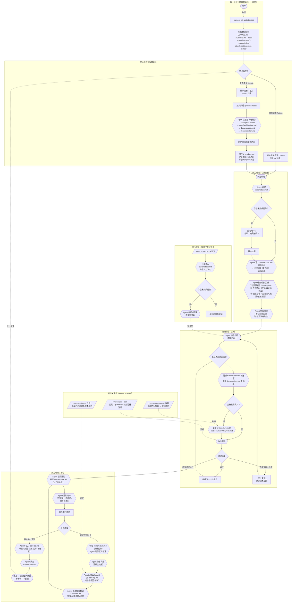

# AI Agent Harness 工作流程图

## 基础版（无样式）

---

## 样式版（带颜色区分）

```mermaid
%%{init: {
  "theme": "base",
  "themeVariables": {
    "primaryColor": "#e8f4fd",
    "primaryBorderColor": "#2196F3",
    "secondaryColor": "#e8f5e9",
    "tertiaryColor": "#fff3e0",
    "background": "#ffffff",
    "mainBkg": "#ffffff",
    "nodeBorder": "#cccccc",
    "clusterBkg": "#fafafa",
    "titleColor": "#333333",
    "edgeLabelBackground": "#ffffff",
    "fontFamily": "PingFang SC, Microsoft YaHei, sans-serif"
  }
}}%%
flowchart TD
    %% ─────────────────────────────────────────
    %% Phase 1: Project Setup
    %% ─────────────────────────────────────────
    subgraph P1["📁 第一阶段：项目初始化（一次性）"]
        direction TB
        U1([👤 用户]) -->|执行命令| CMD1["harness init /path/to/repo"]
        CMD1 --> GEN["⚙️ 生成骨架文件\nCLAUDE.md · AGENTS.md · docs/\n.agent-harness/ · .claude/rules/\n.claude/settings.json · notes/"]
    end

    %% ─────────────────────────────────────────
    %% Phase 2: Requirement Input
    %% ─────────────────────────────────────────
    subgraph P2["📝 第二阶段：需求录入"]
        direction TB
        GEN --> ROUTE{需求类型？}

        ROUTE -->|"Path A\n简单需求"| SA["👤 用户直接告知\n「做 XX 功能」"]

        ROUTE -->|"Path B\n复杂需求"| B1["👤 将素材写入\nnotes/ 目录"]
        B1 --> B2["👤 执行 /process-notes"]
        B2 --> B3["🤖 Agent 提取结构化需求\n→ docs/product.md\n→ docs/architecture.md\n→ docs/runbook.md\n→ docs/workflow.md"]
        B3 --> B4["👤 用户审阅摘要并确认"]
        B4 --> B5["👤 从 product.md 选取功能\n告知 Agent 开始"]
    end

    SA --> P3_START
    B5 --> P3_START

    %% ─────────────────────────────────────────
    %% Phase 3: Task Planning
    %% ─────────────────────────────────────────
    subgraph P3["📋 第三阶段：任务规划"]
        direction TB
        P3_START(["开始规划"]) --> CT1["🤖 读取 current-task.md"]
        CT1 --> CT2{存在未完成任务？}
        CT2 -->|是| CT3["🤖 询问用户：\n继续 or 替换？"]
        CT3 --> CT4["👤 用户决策"]
        CT2 -->|否| CT5
        CT4 --> CT5["🤖 写入 current-task.md\n· 任务目标\n· 计划步骤（复选框）\n· 完成标准"]
        CT5 --> CT6["🤖 列出三类测试场景\n✓ 正常路径\n✓ 边界情况\n✓ 错误路径"]
        CT6 --> CT7["🤖 先写测试\n确认测试失败"]
    end

    %% ─────────────────────────────────────────
    %% Phase 4: Implementation
    %% ─────────────────────────────────────────
    subgraph P4["⚒️ 第四阶段：实现"]
        direction TB
        CT7 --> IMPL1["🤖 编写代码\n使测试通过"]
        IMPL1 --> IMPL2{功能点完成？}
        IMPL2 --> IMPL3["🤖 更新复选框\ncurrent-task.md\nproduct.md"]
        IMPL3 --> IMPL4{文档需要同步？}
        IMPL4 -->|是| IMPL5["🤖 更新\narchitecture.md /\nrunbook.md / AGENTS.md"]
        IMPL4 -->|否| IMPL6
        IMPL5 --> IMPL6["🤖 运行测试"]
        IMPL6 --> IMPL7{测试结果}
        IMPL7 -->|通过| IMPL8["继续下一功能点"]
        IMPL7 -->|"连续失败\n≥ 3 次"| IMPL9["🤖 停止重试\n分析根本原因"]
        IMPL8 --> IMPL2
        IMPL9 --> IMPL1
    end

    %% ─────────────────────────────────────────
    %% Phase 5: Verification
    %% ─────────────────────────────────────────
    subgraph P5["✅ 第五阶段：验证"]
        direction TB
        IMPL7 -->|所有测试通过| VER1["🤖 标记「待验证」\ncurrent-task.md"]
        VER1 --> VER2["🤖 通知用户\n附验证说明"]
        VER2 --> VER3["👤 执行验证"]
        VER3 --> VER4{验证结果}

        VER4 -->|"Branch A\n确认通过"| VA1["🤖 写入 task-log.md\n需求·变更·决策·文件"]
        VA1 --> VA2["🤖 清空 current-task.md"]
        VA2 --> DONE(["完成 ✓\n→ 返回第二阶段"])

        VER4 -->|"Branch B\n反馈问题"| VB1["🤖 保留 current-task.md\n追加返工备注"]
        VB1 --> VB2["🤖 修复问题\n更新复选框"]
        VB2 --> VB3["🤖 追加返工记录\ntask-log.md\n反馈·根因·修复"]
        VB3 --> VB4["🤖 追加经验教训\nlessons.md\n错误·根因·预防规则"]
        VB4 --> VER1
    end

    %% ─────────────────────────────────────────
    %% Phase 6: Session Recovery
    %% ─────────────────────────────────────────
    subgraph P6["🔄 第六阶段：会话中断与恢复"]
        direction TB
        SR1[/"🔔 SessionStart Hook 触发"/] --> SR2["⚙️ 自动注入\ncurrent-task.md\n到上下文"]
        SR2 --> SR3{存在未完成任务？}
        SR3 -->|是| SR4["🤖 从断点恢复\n不重新开始"]
        SR3 -->|否| SR5["正常开始新会话"]
    end

    SR4 -.->|恢复到| IMPL1
    DONE -.->|开发下一功能| ROUTE

    %% ─────────────────────────────────────────
    %% Cross-cutting Concerns
    %% ─────────────────────────────────────────
    subgraph CC["🔧 横切关注点（Hooks & Rules）"]
        direction LR
        H1[/"🔔 PreToolUse Hook\ngit commit 前先运行测试"/]
        H2[/"📏 documentation-sync 规则\n代码 → 文档强制映射"/]
        H3[/"📏 error-attribution 规则\n返工必须分析根本原因"/]
    end

    H1 -.->|监控| IMPL6
    H2 -.->|约束| IMPL5
    H3 -.->|约束| VB3

    %% ─────────────────────────────────────────
    %% Node Styles
    %% ─────────────────────────────────────────

    %% 用户操作节点 — 蓝色
    style U1   fill:#BBDEFB,stroke:#1565C0,color:#0D47A1
    style SA   fill:#BBDEFB,stroke:#1565C0,color:#0D47A1
    style B1   fill:#BBDEFB,stroke:#1565C0,color:#0D47A1
    style B2   fill:#BBDEFB,stroke:#1565C0,color:#0D47A1
    style B4   fill:#BBDEFB,stroke:#1565C0,color:#0D47A1
    style B5   fill:#BBDEFB,stroke:#1565C0,color:#0D47A1
    style CT4  fill:#BBDEFB,stroke:#1565C0,color:#0D47A1
    style VER3 fill:#BBDEFB,stroke:#1565C0,color:#0D47A1

    %% Agent 操作节点 — 绿色
    style B3   fill:#C8E6C9,stroke:#2E7D32,color:#1B5E20
    style CT1  fill:#C8E6C9,stroke:#2E7D32,color:#1B5E20
    style CT3  fill:#C8E6C9,stroke:#2E7D32,color:#1B5E20
    style CT5  fill:#C8E6C9,stroke:#2E7D32,color:#1B5E20
    style CT6  fill:#C8E6C9,stroke:#2E7D32,color:#1B5E20
    style CT7  fill:#C8E6C9,stroke:#2E7D32,color:#1B5E20
    style IMPL1 fill:#C8E6C9,stroke:#2E7D32,color:#1B5E20
    style IMPL3 fill:#C8E6C9,stroke:#2E7D32,color:#1B5E20
    style IMPL5 fill:#C8E6C9,stroke:#2E7D32,color:#1B5E20
    style IMPL6 fill:#C8E6C9,stroke:#2E7D32,color:#1B5E20
    style IMPL9 fill:#C8E6C9,stroke:#2E7D32,color:#1B5E20
    style VER1 fill:#C8E6C9,stroke:#2E7D32,color:#1B5E20
    style VER2 fill:#C8E6C9,stroke:#2E7D32,color:#1B5E20
    style VA1  fill:#C8E6C9,stroke:#2E7D32,color:#1B5E20
    style VA2  fill:#C8E6C9,stroke:#2E7D32,color:#1B5E20
    style VB1  fill:#C8E6C9,stroke:#2E7D32,color:#1B5E20
    style VB2  fill:#C8E6C9,stroke:#2E7D32,color:#1B5E20
    style VB3  fill:#C8E6C9,stroke:#2E7D32,color:#1B5E20
    style VB4  fill:#C8E6C9,stroke:#2E7D32,color:#1B5E20
    style SR4  fill:#C8E6C9,stroke:#2E7D32,color:#1B5E20

    %% 系统 / Hooks 节点 — 橙色
    style CMD1 fill:#FFE0B2,stroke:#E65100,color:#BF360C
    style GEN  fill:#FFE0B2,stroke:#E65100,color:#BF360C
    style SR1  fill:#FFE0B2,stroke:#E65100,color:#BF360C
    style SR2  fill:#FFE0B2,stroke:#E65100,color:#BF360C
    style H1   fill:#FFE0B2,stroke:#E65100,color:#BF360C
    style H2   fill:#FFE0B2,stroke:#E65100,color:#BF360C
    style H3   fill:#FFE0B2,stroke:#E65100,color:#BF360C

    %% 终止节点 — 灰色
    style DONE fill:#F5F5F5,stroke:#757575,color:#424242
    style SR5  fill:#F5F5F5,stroke:#757575,color:#424242
```

---

## 图例说明

| 颜色 | 含义 |
|------|------|
| 蓝色节点 | 用户操作（User Action） |
| 绿色节点 | Agent 操作（Agent Action） |
| 橙色节点 | 系统命令 / Hook 触发（System / Hook） |
| 菱形 | 决策判断点（Decision） |
| 圆角矩形 | 起始 / 终止节点 |
| 平行四边形 `/  /` | Hook 或自动触发事件 |
| 虚线箭头 `-.->` | 跨阶段跳转或横切约束 |

## 渲染方式

1. **VS Code**: 安装 Mermaid Preview 扩展，打开此文件后点击预览
2. **在线工具**: 将代码块内容粘贴到 [mermaid.live](https://mermaid.live)
3. **GitHub**: 直接在 `.md` 文件中渲染（GitHub 原生支持 Mermaid）
4. **导出**: 在 mermaid.live 中可导出为 SVG / PNG

> 建议使用**样式版**作为正式参考图，**基础版**用于在不支持样式的环境中快速预览。
